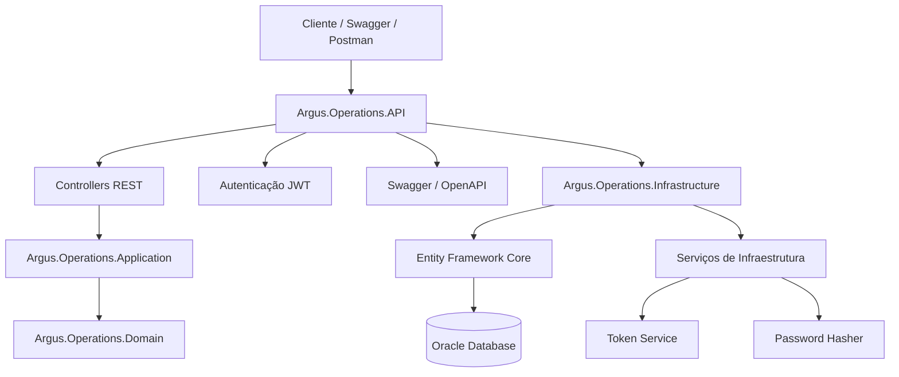
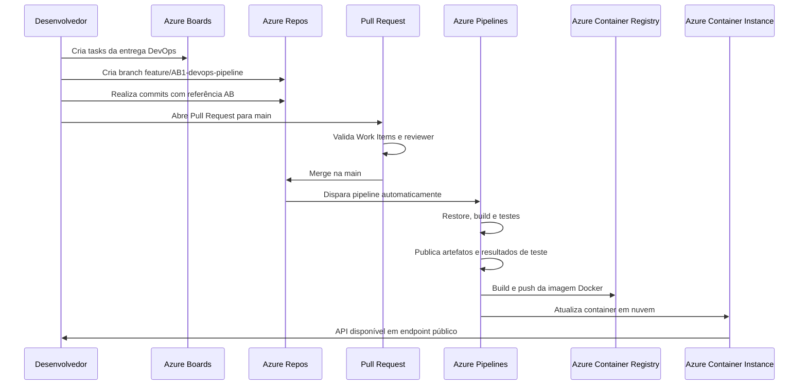
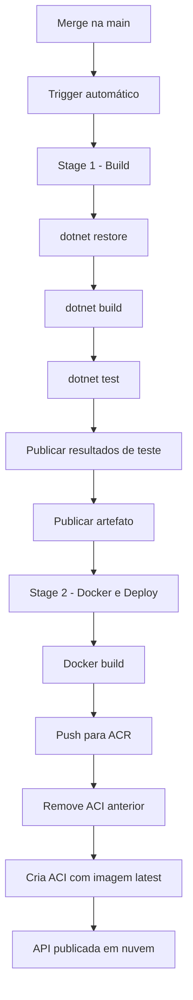

# Argus Operations API — DevOps Tools & Cloud Computing

<p align="center">
  
  
  
  
  
  
  
</p>

---

## 1. Visão Geral

O **Argus Operations API** é uma API REST desenvolvida em **C# com ASP.NET Core .NET 9**, utilizada para gerenciamento operacional de brigadas, recursos e ocorrências relacionadas a operações de monitoramento, prevenção e resposta.

Este repositório foi estruturado para a entrega da disciplina **DevOps Tools & Cloud Computing**, utilizando uma solução da disciplina **Advanced Business Development with .NET**.

A entrega demonstra um fluxo DevOps completo utilizando:

* **Azure Boards** para planejamento e rastreabilidade.
* **Azure Repos** para versionamento Git.
* **Azure Pipelines** para integração contínua e entrega contínua.
* **Azure CLI** para provisionamento da infraestrutura em nuvem.
* **Docker** para containerização da API.
* **Azure Container Registry — ACR** para armazenamento da imagem Docker.
* **Azure Container Instance — ACI** para execução da API em nuvem.
* **Testes automatizados** com publicação dos resultados na pipeline.
* **Artefatos de build** publicados no Azure Pipelines.
* **CRUD em JSON** validado em ambiente de nuvem.

---

## 2. Integrantes

| Nome                          |       RM | Responsabilidade                                                         |
| ----------------------------- | -------: | ------------------------------------------------------------------------ |
| Maria Eduarda Araujo Penas    | RM560944 | DevOps, Azure DevOps, Azure Repos, Azure Pipelines, documentação e vídeo |
| Alane Rocha da Silva          | RM561052 | Backend .NET, infraestrutura Azure, banco de dados e deploy              |
| Anna Beatriz de Araujo Bonfim | RM559561 | Apoio em frontend, IA, documentação e validações                         |

---

## 3. Objetivo da Entrega DevOps

O objetivo desta entrega é implementar em nuvem uma solução .NET utilizando o ecossistema do **Azure DevOps**, contemplando planejamento, versionamento, build, testes, artefatos, deploy automatizado e infraestrutura provisionada via script.

### Requisitos atendidos

| Requisito                       | Implementação                                     |
| ------------------------------- | ------------------------------------------------- |
| Projeto privado no Azure DevOps | Projeto criado no Azure DevOps                    |
| Código no Azure Repos           | Repositório Git importado para Azure Repos        |
| Azure Boards                    | Tasks criadas para organização da entrega         |
| Vinculação de Boards com Repos  | Tasks vinculadas a branch, commits e Pull Request |
| Branch principal protegida      | Políticas aplicadas na branch `main`              |
| Revisor obrigatório             | Política de PR configurada                        |
| Work Item obrigatório           | Pull Request vinculado aos Work Items             |
| Build automático                | Pipeline acionada na branch `main`                |
| Testes automatizados            | Execução de testes xUnit na pipeline              |
| Artefatos publicados            | Publicação de artefato no estágio de Build        |
| Release/deploy automático       | Deploy em Azure Container Instance                |
| Infraestrutura via Azure CLI    | Script em `/scripts/script-infra-create.sh`       |
| Dockerfile                      | Arquivo em `/dockerfiles/Dockerfile`              |
| Script de banco                 | Arquivo `/scripts/script-bd.sql`                  |
| Pipeline YAML                   | Arquivo `azure-pipeline.yml` na raiz              |
| Dados sensíveis protegidos      | Uso de variáveis de ambiente e Service Connection |

---

## 4. Stack Técnica

| Camada              | Tecnologia               |
| ------------------- | ------------------------ |
| Linguagem           | C#                       |
| Framework           | ASP.NET Core .NET 9      |
| Arquitetura         | Clean Architecture       |
| API                 | REST JSON                |
| ORM                 | Entity Framework Core    |
| Banco de dados      | Oracle                   |
| Autenticação        | JWT Bearer               |
| Documentação da API | Swagger / OpenAPI        |
| Testes              | xUnit                    |
| Containerização     | Docker                   |
| Registry            | Azure Container Registry |
| Deploy              | Azure Container Instance |
| CI/CD               | Azure Pipelines          |
| Versionamento       | Azure Repos Git          |
| Gestão de tarefas   | Azure Boards             |
| Infraestrutura      | Azure CLI                |

---

## 5. Arquitetura da Aplicação C#/.NET

A aplicação foi organizada em camadas, separando responsabilidades entre API, aplicação, domínio, infraestrutura e testes.



### Projetos da Solution

| Projeto                           | Responsabilidade                                                    |
| --------------------------------- | ------------------------------------------------------------------- |
| `Argus.Operations.API`            | Controllers, autenticação, Swagger, middlewares e configuração HTTP |
| `Argus.Operations.Application`    | Regras de aplicação, contratos, interfaces e DTOs                   |
| `Argus.Operations.Domain`         | Entidades, enums e regras de domínio                                |
| `Argus.Operations.Infrastructure` | Persistência, Entity Framework, serviços concretos e integrações    |
| `Argus.Operations.Tests`          | Testes automatizados com xUnit                                      |

---

## 6. Arquitetura DevOps em Nuvem

A arquitetura DevOps utiliza Azure DevOps para controlar o ciclo de vida da aplicação e Azure Cloud para executar a API publicada em container.

```mermaid
flowchart LR
    Dev[Desenvolvedor] --> Boards[Azure Boards]
    Dev --> Repos[Azure Repos]

    Boards --> Tasks[Tasks / Work Items]
    Tasks --> Branch[Feature Branch]

    Repos --> Branch
    Branch --> Commit[Commits vinculados]
    Commit --> PR[Pull Request]

    PR --> Policy[Branch Policy]
    Policy --> Main[Main protegida]

    Main --> Pipeline[Azure Pipelines]

    Pipeline --> CI[Build CI]
    CI --> Restore[dotnet restore]
    Restore --> Build[dotnet build]
    Build --> Test[dotnet test]
    Test --> Artifact[Artefatos]

    Pipeline --> CD[Release CD]
    CD --> Docker[Docker Build]
    Docker --> ACR[Azure Container Registry]
    ACR --> ACI[Azure Container Instance]

    ACI --> API[API .NET em Nuvem]
    API --> Database[(Banco de Dados)]
```



---

## 7. Fluxo DevOps Implementado



---

## 8. Azure Boards

O projeto foi organizado no **Azure Boards** com tasks separadas para demonstrar planejamento, rastreabilidade e controle da implementação.

### Tasks criadas

| Work Item | Título                                                               | Objetivo                                                |
| --------- | -------------------------------------------------------------------- | ------------------------------------------------------- |
| AB#1      | Implementar pipeline CI/CD e deploy em nuvem da API Argus Operations | Task principal da entrega DevOps                        |
| AB#2      | Provisionar infraestrutura Azure via Azure CLI                       | Criação dos recursos Azure por script                   |
| AB#3      | Organizar arquivos obrigatórios da entrega DevOps                    | Estrutura de `/scripts`, `/dockerfiles`, `/docs` e YAML |
| AB#4      | Configurar pipeline de build e testes automatizados                  | Restore, build, testes e artefatos                      |
| AB#5      | Configurar deploy automático em nuvem com ACR e ACI                  | Build da imagem, push no ACR e deploy no ACI            |
| AB#6      | Configurar proteção da branch main e fluxo de Pull Request           | Branch policies, reviewer e vínculo com Work Item       |
| AB#7      | Preparar documentação final, arquitetura e roteiro do vídeo          | README, arquitetura, PDF e vídeo                        |

As tasks foram vinculadas ao Pull Request e aos commits por meio da referência `AB#`.

Exemplo de commit vinculado:

```bash
git commit -m "docs: reestrutura readme com foco devops AB#7"
```

---

## 9. Azure Repos

O código fonte foi importado para o **Azure Repos**, mantendo Git como sistema de versionamento.

### Branches principais

| Branch                        | Finalidade                                |
| ----------------------------- | ----------------------------------------- |
| `main`                        | Branch principal protegida                |
| `feature/AB1-devops-pipeline` | Branch de implementação da entrega DevOps |

### Fluxo adotado

1. Código importado para o Azure Repos.
2. Criação de branch de feature.
3. Commits vinculados às tasks do Azure Boards.
4. Abertura de Pull Request para a `main`.
5. Validação por políticas de branch.
6. Merge na `main`.
7. Execução automática da pipeline.

---

## 10. Proteção da Branch Main

A branch `main` foi configurada com políticas para garantir controle e rastreabilidade.

| Política                   | Configuração                                           |
| -------------------------- | ------------------------------------------------------ |
| Pull Request obrigatório   | Sim                                                    |
| Número mínimo de revisores | 1                                                      |
| Revisor padrão             | Usuário RM561052                                       |
| Work Item vinculado        | Obrigatório                                            |
| Commits diretos na main    | Evitados pelo fluxo de PR                              |
| Aprovação própria          | Permitida para simulação acadêmica, conforme enunciado |

Essa configuração garante que alterações relevantes sejam feitas via branch, revisadas e vinculadas a uma tarefa do Azure Boards.

---

## 11. Infraestrutura Azure via Azure CLI

A infraestrutura foi provisionada por script Azure CLI, localizado em:

```txt
/scripts/script-infra-create.sh
```

### Recursos criados

| Recurso                  | Nome                 |
| ------------------------ | -------------------- |
| Resource Group           | `rg-argus-rm561052`  |
| Azure Container Registry | `acrargusrm561052`   |
| Azure Container Instance | `aci-argus-rm561052` |
| DNS Label                | `argus-rm561052-api` |

### Estratégia de deploy

A estratégia utilizada foi:

```txt
Container + Azure Container Registry + Azure Container Instance
```

O **Azure Container Registry** armazena a imagem Docker da API.
O **Azure Container Instance** executa a imagem em nuvem com endpoint público.

---

## 12. Estrutura Obrigatória da Entrega

O repositório foi organizado para atender aos requisitos da disciplina.

```txt
ARGUS-OPERATIONS-DOTNET-DEVOPS
├── Argus.Operations.API
├── Argus.Operations.Application
├── Argus.Operations.Domain
├── Argus.Operations.Infrastructure
├── Argus.Operations.Tests
├── dockerfiles
│   └── Dockerfile
├── scripts
│   ├── script-infra-create.sh
│   ├── script-bd.sql
│   └── seed-dados-teste.sql
├── docs
│   ├── estrutura-entrega.md
│   ├── branch-policy.md
│   └── arquitetura-macro.md
├── azure-pipeline.yml
├── Argus.Operations.sln
└── README.md
```

### Arquivos obrigatórios

| Arquivo                          | Descrição                                               |
| -------------------------------- | ------------------------------------------------------- |
| `scripts/script-infra-create.sh` | Script Azure CLI para provisionamento da infraestrutura |
| `scripts/script-bd.sql`          | DDL dos objetos de banco                                |
| `scripts/seed-dados-teste.sql`   | Dados iniciais para testes                              |
| `dockerfiles/Dockerfile`         | Dockerfile da API .NET                                  |
| `azure-pipeline.yml`             | Pipeline CI/CD do Azure DevOps                          |
| `README.md`                      | Documentação da solução e da entrega DevOps             |

---

## 13. Pipeline CI/CD

A pipeline está definida no arquivo:

```txt
azure-pipeline.yml
```

Ela é acionada automaticamente após alterações na branch `main`.



### Stage 1 — Build

O estágio de Build executa:

1. Instalação do SDK .NET 9.
2. Restore das dependências.
3. Build da solution.
4. Execução dos testes automatizados.
5. Publicação dos resultados de teste.
6. Publicação do artefato da API.

### Stage 2 — Docker e Deploy

O estágio de Deploy executa:

1. Login no Azure.
2. Login no Azure Container Registry.
3. Build da imagem Docker.
4. Push da imagem para o ACR.
5. Remoção do Azure Container Instance anterior.
6. Criação de novo Azure Container Instance com a imagem atualizada.
7. Exibição do endpoint público da API.

---

## 14. Docker

A API foi containerizada utilizando o arquivo:

```txt
dockerfiles/Dockerfile
```

### Build local da imagem

```bash
docker build -f dockerfiles/Dockerfile -t argus-operations-api .
```

### Execução local do container

```bash
docker run -p 8080:8080 argus-operations-api
```

Endpoint local:

```txt
http://localhost:8080
```

---

## 15. Variáveis de Ambiente e Segurança

Dados sensíveis não devem ser expostos no código fonte.

A aplicação utiliza variáveis de ambiente para configurações sensíveis, como conexão com banco e autenticação.

Exemplos:

```txt
ASPNETCORE_ENVIRONMENT=Production
ASPNETCORE_URLS=http://+:8080
ConnectionStrings__DefaultConnection=CONFIGURADO_EM_AMBIENTE_SEGURO
Jwt__Key=CONFIGURADO_EM_AMBIENTE_SEGURO
Jwt__Issuer=CONFIGURADO_EM_AMBIENTE_SEGURO
Jwt__Audience=CONFIGURADO_EM_AMBIENTE_SEGURO
```

Na entrega, os dados sensíveis devem ser protegidos por:

* Azure DevOps Service Connection;
* variáveis secretas da pipeline;
* variáveis de ambiente do container;
* configurações seguras fora do repositório.

---

## 16. Banco de Dados

O script DDL dos objetos do banco está versionado em:

```txt
scripts/script-bd.sql
```

O script de carga de dados de teste está em:

```txt
scripts/seed-dados-teste.sql
```

Durante a demonstração, a persistência das operações CRUD deve ser validada diretamente no banco por comandos `SELECT`.

Exemplos:

```sql
SELECT * FROM TB_BRIGADAS;
SELECT * FROM TB_RECURSOS;
```

---

## 17. Endpoints da API

A API expõe endpoints REST em JSON e possui documentação via Swagger.

Swagger local ou publicado:

```txt
/swagger
```

### Autenticação

| Método | Endpoint             | Descrição                             |
| ------ | -------------------- | ------------------------------------- |
| POST   | `/api/auth/login`    | Realiza login e retorna token JWT     |
| POST   | `/api/auth/register` | Registra novo usuário                 |
| GET    | `/api/auth/me`       | Retorna dados do usuário autenticado  |
| PUT    | `/api/auth/me`       | Atualiza dados do usuário autenticado |

### Alertas e Focos

| Método | Endpoint                             | Descrição                          |
| ------ | ------------------------------------ | ---------------------------------- |
| GET    | `/api/alertas`                       | Lista alertas críticos             |
| GET    | `/api/alertas/{id}`                  | Busca alerta por ID                |
| POST   | `/api/alertas/{id}/criar-ocorrencia` | Cria ocorrência a partir de alerta |
| GET    | `/api/focos`                         | Lista focos de calor               |

### Brigadas

| Método | Endpoint             | Descrição                      |
| ------ | -------------------- | ------------------------------ |
| GET    | `/api/brigadas`      | Lista todas as brigadas        |
| GET    | `/api/brigadas/{id}` | Busca uma brigada por ID       |
| POST   | `/api/brigadas`      | Cria uma nova brigada          |
| PUT    | `/api/brigadas/{id}` | Atualiza uma brigada existente |
| DELETE | `/api/brigadas/{id}` | Remove uma brigada             |

### Recursos

| Método | Endpoint             | Descrição                     |
| ------ | -------------------- | ----------------------------- |
| GET    | `/api/recursos`      | Lista todos os recursos       |
| GET    | `/api/recursos/{id}` | Busca um recurso por ID       |
| POST   | `/api/recursos`      | Cria um novo recurso          |
| PUT    | `/api/recursos/{id}` | Atualiza um recurso existente |
| DELETE | `/api/recursos/{id}` | Remove um recurso             |

### Outros recursos

```txt
brigadistas
ocorrencias
registroscampo
usuarios
```

---

## 18. Exemplos de CRUD em JSON

Para a demonstração da entrega, foram selecionadas duas entidades principais:

1. **Brigadas**
2. **Recursos**

Essas entidades permitem demonstrar operações completas de Create, Read, Update e Delete em JSON.

---

### 18.1 CRUD — Brigadas

#### Create — POST `/api/brigadas`

```json
{
  "nome": "Brigada DevOps Azure",
  "baseOperacional": "Base FIAP Paulista",
  "telefone": "11999990000",
  "ativa": true
}
```

#### Read — GET `/api/brigadas`

```http
GET /api/brigadas
Authorization: Bearer {token}
```

#### Update — PUT `/api/brigadas/{id}`

No PUT, o `id` da URL precisa ser igual ao `id` enviado no corpo da requisição.

```json
{
  "id": 10,
  "nome": "Brigada DevOps Azure Atualizada",
  "baseOperacional": "Base FIAP Cloud",
  "telefone": "11888887777",
  "ativa": true
}
```

#### Delete — DELETE `/api/brigadas/{id}`

```http
DELETE /api/brigadas/10
Authorization: Bearer {token}
```

#### Validação no banco

```sql
SELECT * FROM TB_BRIGADAS;
```

---

### 18.2 CRUD — Recursos

A entidade `Recurso` possui relacionamento com `Brigada`, por meio do campo `brigadaId`.

Por isso, para criar um recurso, primeiro é necessário possuir uma brigada cadastrada.

#### Enum `TipoRecurso`

| Valor | Tipo        |
| ----: | ----------- |
|     1 | Veiculo     |
|     2 | Ferramenta  |
|     3 | EPI         |
|     4 | Comunicacao |

#### Create — POST `/api/recursos`

Exemplo usando `brigadaId = 10`:

```json
{
  "nome": "Veiculo DevOps Azure",
  "tipo": 1,
  "disponivel": true,
  "brigadaId": 10
}
```

#### Read — GET `/api/recursos`

```http
GET /api/recursos
Authorization: Bearer {token}
```

#### Update — PUT `/api/recursos/{id}`

Exemplo usando `id = 5` e `brigadaId = 10`:

```json
{
  "id": 5,
  "nome": "Veiculo DevOps Azure Atualizado",
  "tipo": 1,
  "disponivel": false,
  "brigadaId": 10
}
```

#### Delete — DELETE `/api/recursos/{id}`

```http
DELETE /api/recursos/5
Authorization: Bearer {token}
```

#### Validação no banco

```sql
SELECT * FROM TB_RECURSOS;
```

---

## 19. Ordem Recomendada para Teste de CRUD

Para evitar erro de relacionamento entre `Brigada` e `Recurso`, a ordem recomendada é:

1. Realizar login.
2. Copiar o token JWT.
3. Autorizar as requisições no Swagger ou Postman.
4. Criar uma brigada.
5. Executar `GET /api/brigadas`.
6. Atualizar a brigada.
7. Criar um recurso usando o `id` da brigada criada.
8. Executar `GET /api/recursos`.
9. Atualizar o recurso.
10. Validar no banco com `SELECT * FROM TB_BRIGADAS;`.
11. Validar no banco com `SELECT * FROM TB_RECURSOS;`.
12. Deletar o recurso.
13. Deletar a brigada.
14. Validar novamente no banco com `SELECT`.

---

## 20. Execução Local

### Pré-requisitos

* .NET SDK 9
* Git
* Banco Oracle configurado
* Visual Studio Code ou Visual Studio
* Docker, opcional

### Restaurar dependências

```bash
dotnet restore Argus.Operations.sln
```

### Compilar

```bash
dotnet build Argus.Operations.sln
```

### Executar testes

```bash
dotnet test Argus.Operations.sln
```

Resultado validado localmente:

```txt
Resumo do teste: total: 38; falhou: 0; bem-sucedido: 38; ignorado: 0
```

### Executar API

```bash
dotnet run --project Argus.Operations.API
```

---

## 21. Testes Automatizados

Os testes ficam no projeto:

```txt
Argus.Operations.Tests
```

Execução local:

```bash
dotnet test Argus.Operations.sln
```

Na validação local, foram executados:

```txt
38 testes
0 falhas
```

Na pipeline, os testes são executados automaticamente e os resultados são publicados no Azure Pipelines.

---

## 22. Evidências que Devem Aparecer no Vídeo

Durante o vídeo demonstrativo, devem ser evidenciados:

| Etapa         | Evidência                                           |
| ------------- | --------------------------------------------------- |
| README        | Solução, conceito e arquitetura                     |
| Azure Portal  | Resource Group, ACR e ACI criados                   |
| Azure Boards  | Tasks criadas e vinculadas                          |
| Azure Repos   | Código fonte importado                              |
| Branch        | Branch `feature/AB1-devops-pipeline`                |
| Pull Request  | PR para a main com Work Items                       |
| Branch Policy | Main protegida com reviewer e Work Item obrigatório |
| Pipeline CI   | Restore, build, testes e artefatos                  |
| Pipeline CD   | Docker build, push no ACR e deploy no ACI           |
| ACR           | Imagem Docker publicada                             |
| ACI           | Container rodando em nuvem                          |
| API           | Endpoint público acessível                          |
| CRUD          | Create, Read, Update e Delete em duas tabelas       |
| Banco         | SELECT comprovando persistência                     |
| Boards final  | Tasks concluídas com links de PR/commits            |

---

## 23. Links da Entrega

| Item                     | Link                          |
| ------------------------ | ----------------------------- |
| Organização Azure DevOps | `INSERIR_LINK_DA_ORGANIZACAO` |
| Projeto Azure DevOps     | `INSERIR_LINK_DO_PROJETO`     |
| Repositório Azure Repos  | `INSERIR_LINK_DO_REPOSITORIO` |
| Pipeline Azure DevOps    | `INSERIR_LINK_DA_PIPELINE`    |
| Endpoint público da API  | `INSERIR_ENDPOINT_DA_API`     |
| Vídeo YouTube            | `INSERIR_LINK_DO_VIDEO`       |

---

## 24. Checklist da Entrega

| Item                                 | Status                          |
| ------------------------------------ | ------------------------------- |
| Projeto privado no Azure DevOps      | Concluído                       |
| Código no Azure Repos                | Concluído                       |
| Azure Boards com tasks               | Concluído                       |
| Branch de feature criada             | Concluído                       |
| Pull Request criado                  | Concluído                       |
| Work Items vinculados                | Concluído                       |
| Branch main protegida                | Concluído                       |
| Script Azure CLI em `/scripts`       | Concluído                       |
| Script `script-bd.sql` em `/scripts` | Concluído                       |
| Dockerfile em `/dockerfiles`         | Concluído                       |
| `azure-pipeline.yml` na raiz         | Concluído                       |
| Restore local                        | Concluído                       |
| Build local                          | Concluído                       |
| Testes locais                        | Concluído — 38 testes aprovados |
| Pipeline de Build                    | Pendente de execução final      |
| Publicação de testes                 | Pendente de execução final      |
| Publicação de artefato               | Pendente de execução final      |
| Deploy automático em ACI             | Pendente de execução final      |
| CRUD em duas tabelas                 | Pendente de validação final     |
| SELECT no banco                      | Pendente de validação final     |
| Vídeo YouTube                        | Pendente                        |
| PDF final                            | Pendente                        |

---

## 25. Conclusão

Este projeto demonstra a aplicação prática de **DevOps Tools & Cloud Computing** em uma solução real desenvolvida em **C#/.NET**.

A entrega contempla planejamento com Azure Boards, versionamento com Azure Repos, proteção de branch, Pull Request, integração contínua, testes automatizados, publicação de artefatos, containerização com Docker, infraestrutura via Azure CLI e deploy em nuvem com Azure Container Registry e Azure Container Instance.

Com isso, o projeto atende aos principais requisitos da disciplina e demonstra um fluxo completo de desenvolvimento, entrega e publicação de uma API em ambiente cloud.
