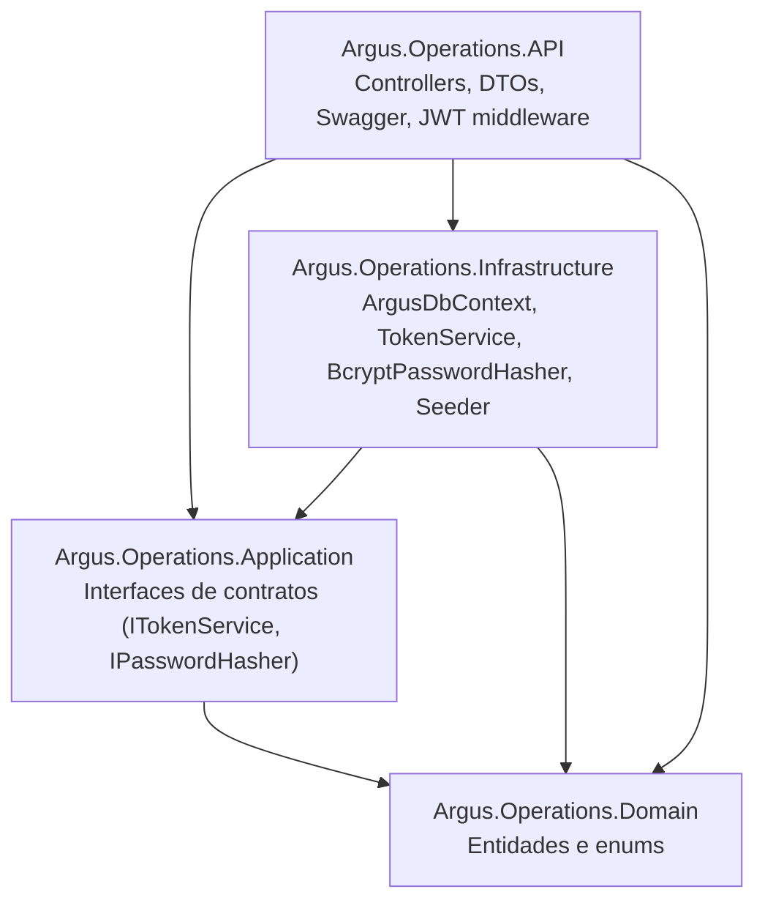
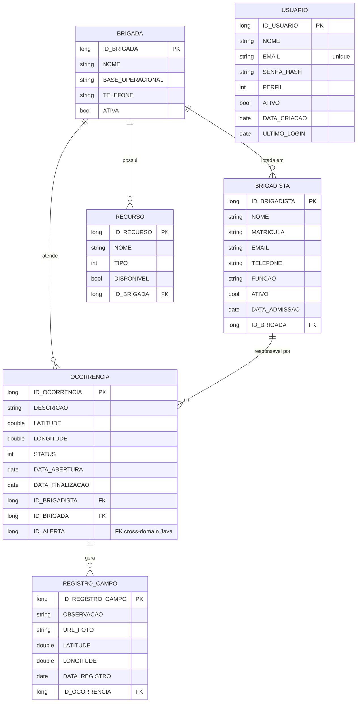

# Argus Operations API

<p align="center">
  
  
  
  
  
  
  
  
  
  
</p>

API operacional do sistema **Argus**, voltada a operações de combate a incêndios florestais. Concentra a gestão de brigadas, brigadistas, recursos materiais, ocorrências em campo e registros de atendimento, expondo um conjunto de endpoints REST protegidos por autenticação JWT.

O projeto faz parte da Global Solution 2026/1 da FIAP, cujo tema é a economia espacial e a aplicação de dados de satélite a problemas reais na Terra. O Argus se posiciona no eixo de **monitoramento ambiental e resposta a desastres**: a API operacional aqui presente é o backend que receberia alertas de queimadas detectadas por satélite (vindos do domínio Java, externo a esta API) e coordenaria a resposta das brigadas em terra.

## Sumário

- [Stack](#stack)
- [Arquitetura](#arquitetura)
- [Modelo de domínio](#modelo-de-domínio)
- [Como rodar localmente](#como-rodar-localmente)
- [Autenticação e autorização](#autenticação-e-autorização)
- [Matriz de permissões](#matriz-de-permissões)
- [Endpoints](#endpoints)
- [Exemplos de uso](#exemplos-de-uso)
- [Tratamento global de erros](#tratamento-global-de-erros)
- [Health check](#health-check)
- [Integração com a API Java](#integração-com-a-api-java)
- [Testes automatizados](#testes-automatizados)
- [Estrutura de pastas](#estrutura-de-pastas)
- [Decisões técnicas relevantes](#decisões-técnicas-relevantes)
- [Deploy na Azure](#deploy-na-azure)
- [Prints e evidências](#prints-e-evidências)
- [Integrantes](#integrantes)

## Stack

| Categoria | Tecnologia |
|---|---|
| Runtime | .NET 9 |
| Web | ASP.NET Core 9 (Controllers + Swagger UI via Swashbuckle 6.9) |
| Persistência | Entity Framework Core 9 com provider Oracle (Oracle.EntityFrameworkCore 9.x) |
| Banco | Oracle 19c (servidor FIAP) |
| Autenticação | JWT Bearer + BCrypt para hash de senhas |
| Logging | Serilog (estruturado, JSON-friendly) + `UseSerilogRequestLogging` |
| Testes | xUnit 2.9 + EF Core InMemory |

## Arquitetura

A solução segue o padrão Clean Architecture com quatro projetos. As dependências apontam sempre em direção ao domínio: a API conhece todas as camadas, mas o domínio não conhece ninguém. Isso permite que regras de negócio fiquem isoladas de detalhes de infraestrutura (qual ORM, qual provider, qual mecanismo de hash).



Os contratos de autenticação ficam na Application (`ITokenService`, `IPasswordHasher`); a implementação concreta (`TokenService`, `BcryptPasswordHasher`) está na Infrastructure. O AuthController depende das interfaces, não da implementação — substituir BCrypt por Argon2 amanhã exigiria uma classe nova na Infrastructure e zero linha alterada no controller.

## Modelo de domínio



A entidade `Usuario` é independente do restante do domínio — representa quem opera o sistema (admin, coordenador ou brigadista). O `ID_ALERTA` em `OCORRENCIA` é uma referência cross-domain ao módulo Java do projeto (não está no escopo deste repositório); por isso é nullable e a FK formal não é criada via EF Core, fica como um simples campo `long?` que será amarrado por `ALTER TABLE` no script SQL consolidado da entrega de Database.

Os enums `PerfilUsuario`, `TipoRecurso` e `StatusOcorrencia` são mapeados como `int` no Oracle (via `HasConversion<int>()`), o que permite filtros e relatórios sem precisar de joins com tabelas de domínio.

## Como rodar localmente

### Pré-requisitos

- .NET 9 SDK
- Acesso ao banco Oracle do FIAP (ou outro Oracle 11+ com `UseOracleSQLCompatibility(DatabaseVersion19)`)
- Opcional: `jq` para formatar respostas de cURL no terminal

### Connection string

A connection string do Oracle **não** está versionada. Configure via user-secrets:

```bash
cd Argus.Operations.API
dotnet user-secrets init    # se ainda não inicializado
dotnet user-secrets set "ConnectionStrings:OracleDb" \
  "User Id=SEU_RM;Password=SUA_SENHA;Data Source=oracle.fiap.com.br:1521/ORCL"
```

Alternativamente, defina a variável de ambiente `ConnectionStrings__OracleDb`.

### Migrations

As migrations já estão versionadas em `Argus.Operations.Infrastructure/Migrations/`. Aplique-as no banco com:

```bash
dotnet ef database update --project Argus.Operations.Infrastructure --startup-project Argus.Operations.API
```

Se preferir criar o schema diretamente via SQL (sem usar EF Core para gerenciar versões), o arquivo `argus-tabelas-dotnet.sql` na raiz contém o DDL consolidado.

### Rodando a API

```bash
dotnet run --project Argus.Operations.API
```

A API sobe em `http://localhost:5215`. A documentação Swagger fica em `http://localhost:5215/swagger`.

No primeiro startup, o `UsuariosSeeder` cria automaticamente o usuário administrador (idempotente — startups subsequentes verificam por email antes de inserir).

## Autenticação e autorização

A API usa JWT Bearer. O fluxo padrão é: o cliente faz POST em `/api/auth/login` com email/senha, recebe um token, e envia esse token no header `Authorization: Bearer <token>` em todas as requisições subsequentes.

### Credenciais de teste

| Email | Senha | Perfil | Como foi criado |
|---|---|---|---|
| `admin@argus.com` | `Admin@123` | Admin | Seed automático no startup |
| `brig@argus.com` | `Brig@123` | Brigadista | Registrado via `POST /api/auth/register` durante o desenvolvimento |

Os usuários persistem no Oracle entre restarts da API. Para resetar, basta deletar as linhas correspondentes em `USUARIO`.

### Login pelo Swagger

1. Abra `http://localhost:5215/swagger`.
2. Em **POST `/api/auth/login`**, clique em "Try it out" e cole:
   ```json
   { "email": "admin@argus.com", "senha": "Admin@123" }
   ```
3. Copie o valor do campo `token` da resposta.
4. Clique no botão **Authorize** no topo da página, cole `Bearer <token>` (com o prefixo `Bearer`), confirme e feche o modal.
5. Todos os endpoints protegidos agora vão receber o header automaticamente.

Para trocar de usuário durante os testes: Authorize > Logout > cola o novo token.

### Endpoint de inspeção

O endpoint `GET /api/auth/me` devolve as claims do token atual e indica em quais roles o usuário está. É útil tanto para debug quanto para o consumo pelo aplicativo mobile.

### Registro de novos usuários

`POST /api/auth/register` exige um campo `codigoConvite`. O valor atual é `ARGUS-2026`, configurável em `appsettings.json > Auth:CodigoConvite`. A presença deste código simula um sistema fechado: na vida real um app operacional de brigada não aceita auto-cadastro público.

Campos do payload:

| Campo | Obrigatório | Restrição | Descrição |
|---|---|---|---|
| `nome` | sim | máx 150 | Nome completo |
| `email` | sim | formato e-mail, máx 150, único | Identidade de login |
| `telefone` | sim | máx 20 | Contato principal |
| `nomeEmergencia` | não | máx 100 | Nome da pessoa a acionar em emergência |
| `telefoneEmergencia` | não | máx 20 | Telefone da pessoa a acionar em emergência |
| `relacaoEmergencia` | não | máx 30 | Relação com o brigadista (ex.: "Mãe", "Cônjuge", "Irmão") |
| `senha` | sim | mín 6 caracteres | É hasheada com BCrypt (workfactor 11) antes de gravar |
| `codigoConvite` | sim | igual ao configurado | Verificação de inscrição autorizada |

Os 3 campos do contato de emergência (`nomeEmergencia`, `telefoneEmergencia`, `relacaoEmergencia`) andam juntos por convenção — ou todos preenchidos, ou nenhum. São opcionais porque usuários administrativos (Admin/Coordenador de escritório) podem não precisar registrar essa informação. A validação dessa coesão fica a cargo do cliente (mobile mostra/esconde o trio como um bloco único).

Exemplo de payload com contato de emergência:

```json
{
  "nome": "Maria Silva",
  "email": "maria.silva@argus.com",
  "telefone": "11987654321",
  "nomeEmergencia": "Joana Silva",
  "telefoneEmergencia": "11988888888",
  "relacaoEmergencia": "Mãe",
  "senha": "Senha@123",
  "codigoConvite": "ARGUS-2026"
}
```

Usuários registrados via essa rota recebem sempre o perfil **Brigadista**. Para criar Coordenadores ou Admins é preciso editar o `AdminSeed` no `appsettings.json` ou inserir diretamente no banco.

## Matriz de permissões

| Endpoint | Admin | Coordenador | Brigadista |
|---|:-:|:-:|:-:|
| CRUD `/api/usuarios` | sim | nao | nao |
| GET `/api/brigadas`, `/brigadistas`, `/recursos` | sim | sim | sim |
| POST/PUT/DELETE em `/brigadas`, `/brigadistas`, `/recursos` | sim | sim | nao |
| GET `/api/ocorrencias` | sim | sim | sim |
| PUT `/api/ocorrencias` (atualizar status em campo) | sim | sim | sim |
| POST/DELETE `/api/ocorrencias` | sim | sim | nao |
| CRUD `/api/registroscampo` | sim | sim | sim |

A restrição é aplicada em duas camadas. No backend, atributos `[Authorize(Roles = "...")]` controlam o acesso a cada endpoint, e a constante única `Roles.AdminECoordenador` evita strings mágicas espalhadas pelo código. No JWT, o claim `role` carrega o perfil do usuário, lido a partir do enum `PerfilUsuario.ToString()`.

## Endpoints

### Autenticação (`/api/auth`)

| Método | Rota | Auth | Descrição |
|---|---|---|---|
| POST | `/login` | público | autentica e devolve JWT |
| POST | `/register` | público (exige `codigoConvite`) | cria novo Brigadista |
| GET | `/me` | qualquer logado | devolve claims e roles do token atual |

### Integração com Java

| Método | Rota | Auth | Descrição |
|---|---|---|---|
| GET | `/api/alertas/{id}` | qualquer logado | proxy pra API Java; devolve os dados do alerta de incêndio detectado por satélite |

### Recursos do domínio

Todos os controllers seguem o padrão CRUD:

| Método | Rota | Função |
|---|---|---|
| GET | `/api/{recurso}` | lista todos |
| GET | `/api/{recurso}/{id}` | busca por id (404 se não existir) |
| POST | `/api/{recurso}` | cria (devolve 201 com `Location` para o `GET /{id}`) |
| PUT | `/api/{recurso}/{id}` | atualiza (204 No Content; 400 se id da URL ≠ id do corpo) |
| DELETE | `/api/{recurso}/{id}` | remove (204 No Content) |

Onde `{recurso}` é um de: `brigadas`, `brigadistas`, `recursos`, `ocorrencias`, `registroscampo`, `usuarios`.

## Exemplos de uso

Todos os exemplos abaixo assumem que a variável `TOKEN` foi populada após o login. Para isso:

```bash
TOKEN=$(curl -s -X POST http://localhost:5215/api/auth/login \
  -H "Content-Type: application/json" \
  -d '{"email":"admin@argus.com","senha":"Admin@123"}' \
  | jq -r '.token')
```

### Listar brigadas

```bash
curl -s http://localhost:5215/api/brigadas \
  -H "Authorization: Bearer $TOKEN" | jq
```

### Criar uma brigada (apenas Admin/Coordenador)

```bash
curl -s -X POST http://localhost:5215/api/brigadas \
  -H "Authorization: Bearer $TOKEN" \
  -H "Content-Type: application/json" \
  -d '{
    "nome": "Brigada PrevFogo Cerrado Norte",
    "baseOperacional": "Brasília, DF",
    "telefone": "6133331234",
    "ativa": true
  }' | jq
```

### Criar um brigadista

```bash
curl -s -X POST http://localhost:5215/api/brigadistas \
  -H "Authorization: Bearer $TOKEN" \
  -H "Content-Type: application/json" \
  -d '{
    "nome": "Maria Silva",
    "matricula": "BRG-042",
    "email": "maria.silva@argus.com",
    "telefone": "11987654321",
    "funcao": "Líder de Esquadrão",
    "ativo": true,
    "dataAdmissao": "2024-03-15T00:00:00",
    "brigadaId": 1
  }' | jq
```

### Abrir uma ocorrência

```bash
curl -s -X POST http://localhost:5215/api/ocorrencias \
  -H "Authorization: Bearer $TOKEN" \
  -H "Content-Type: application/json" \
  -d '{
    "descricao": "Foco de incêndio em vegetação seca, vento moderado",
    "latitude": -15.789,
    "longitude": -47.882,
    "status": 1,
    "dataAbertura": "2026-06-01T14:30:00",
    "brigadistaId": 1,
    "brigadaId": 1,
    "alertaId": null
  }' | jq
```

### Atualizar status de ocorrência como Brigadista

Brigadistas podem fazer PUT em ocorrências para registrar mudança de status (em atendimento → finalizada, por exemplo) mesmo sem permissão de criar ou deletar. Faça login como `brig@argus.com` / `Brig@123` e:

```bash
curl -i -X PUT http://localhost:5215/api/ocorrencias/1 \
  -H "Authorization: Bearer $TOKEN_BRIGADISTA" \
  -H "Content-Type: application/json" \
  -d '{
    "id": 1,
    "descricao": "Foco controlado",
    "latitude": -15.789,
    "longitude": -47.882,
    "status": 3,
    "dataAbertura": "2026-06-01T14:30:00",
    "dataFinalizacao": "2026-06-01T17:45:00",
    "brigadistaId": 1,
    "brigadaId": 1
  }'
```

### Cenários que demonstram a matriz de permissões

Tente com o token de Brigadista:

```bash
# Esperado: 403 Forbidden, role não autorizado
curl -i -X DELETE http://localhost:5215/api/brigadas/1 \
  -H "Authorization: Bearer $TOKEN_BRIGADISTA"
```

```bash
# Esperado: 403 Forbidden, qualquer operação em /api/usuarios é Admin-only
curl -i http://localhost:5215/api/usuarios \
  -H "Authorization: Bearer $TOKEN_BRIGADISTA"
```

## Tratamento global de erros

Um `GlobalExceptionHandler` registrado via `IExceptionHandler` intercepta exceções não tratadas e devolve um `ProblemDetails` consistente. O foco principal é traduzir erros do Oracle em status HTTP semanticamente corretos, em vez de devolver 500 cru com stack trace exposta.

| Código Oracle | Cenário típico | Status HTTP | Título |
|---|---|---|---|
| ORA-00001 | Constraint UNIQUE violada (ex.: email duplicado) | 409 Conflict | Registro duplicado |
| ORA-02291 | FK insert: ID referenciado não existe | 400 Bad Request | Referência inválida |
| ORA-02292 | FK delete: registro tem filhos | 409 Conflict | Registro com dependências |
| ORA-12541 / 12545 / 12170 | TNS: banco inacessível | 503 Service Unavailable | Banco indisponível |
| Outro `DbUpdateException` | Demais erros de gravação | 500 | Erro ao salvar no banco |
| Demais exceções | Bugs ou casos não previstos | 500 | Erro interno |

Os códigos Oracle são detectados via varredura da cadeia de `InnerException`, porque erros de conexão (12541/12545) podem aparecer encapsulados em wrappers diferentes do `DbUpdateException` típico de violações de integridade.

Exemplo de resposta para um `DELETE /api/brigadas/1` quando há brigadistas vinculados à brigada:

```json
{
  "type": "https://httpstatuses.io/409",
  "title": "Registro com dependências",
  "status": 409,
  "detail": "Esse registro está sendo referenciado por outros e não pode ser removido.",
  "instance": "/api/brigadas/1"
}
```

## Health check

`GET /health` é público (sem auth) e retorna um JSON com o status geral e o resultado do check do banco. Útil para load balancers, ferramentas de monitoring e para confirmar rapidamente se a API e a conexão Oracle estão de pé.

```bash
curl -s http://localhost:5215/health | jq
```

Resposta típica:

```json
{
  "status": "Healthy",
  "totalDurationMs": 28.4,
  "checks": [
    { "name": "oracle-db", "status": "Healthy", "durationMs": 28.1, "error": null }
  ]
}
```

Quando o Oracle está fora, `status` vira `Unhealthy`, o HTTP é 503 e o campo `error` traz o motivo retornado pelo provider.

## Integração com a API Java

O Argus opera com dois backends em domínios distintos: o **Java**, responsável pela detecção de focos de incêndio via satélite (geração de alertas), e o **.NET** (este projeto), responsável pelas operações de resposta em campo. A integração entre eles acontece em dois níveis.

**Nível 1 — banco compartilhado.** Ambos usam o mesmo Oracle do FIAP, com schemas independentes. A entidade `Ocorrencia` tem um campo `AlertaId` (nullable) que aponta pra tabela de alertas do Java. A FK formal é criada via `ALTER TABLE` no script SQL consolidado da entrega de Database.

**Nível 2 — chamada HTTP via client tipado.** Um `HttpClient` tipado (`IAlertaJavaClient` na Application, `AlertaJavaClient` na Infrastructure) faz requisições à API Java pra buscar os detalhes de um alerta específico. O endpoint `GET /api/alertas/{id}` deste projeto serve como proxy pra API Java, o que permite ao cliente mobile consultar alertas pelo mesmo backend que já está autenticando.

**Configuração:** a URL base da API Java é configurável em `appsettings.json`:

```json
"JavaApi": {
  "BaseUrl": "http://localhost:8080"
}
```

Pode ser sobrescrita via user-secrets (`JavaApi:BaseUrl`) ou variável de ambiente (`JavaApi__BaseUrl`). O timeout default é 10 segundos.

**Tratamento de erros da chamada externa.** Tanto a falha de conexão (Java fora do ar) quanto o timeout são interceptados pelo `GlobalExceptionHandler`:

| Cenário | Status HTTP | Título |
|---|---|---|
| Java retorna 404 | 404 Not Found | (resposta normal do controller) |
| Java retorna sucesso | 200 OK | (devolve `AlertaDto` ao cliente) |
| `HttpRequestException` (Java fora) | 503 Service Unavailable | API externa indisponível |
| `TaskCanceledException` (timeout >10s) | 504 Gateway Timeout | Timeout em API externa |

**Contrato esperado do retorno da API Java** (atualmente uma suposição — ajustar quando o time do Java confirmar):

```csharp
record AlertaDto(
    long Id,
    double Latitude,
    double Longitude,
    string? Severidade,
    DateTime DataDeteccao,
    string? Status
);
```

Se os nomes de campo do retorno real do Java forem diferentes, basta ajustar o `AlertaDto` em `Argus.Operations.Application/Integration/`. O resto do código (controller, client, registro do HttpClient) permanece igual.

## Testes automatizados

O projeto `Argus.Operations.Tests` reúne testes unitários e integração-leve com xUnit, todos seguindo o padrão Arrange/Act/Assert com comentários explícitos para tornar a estrutura legível.

```bash
dotnet test
```

Cobertura atual (26 testes verdes em torno de 1 segundo):

- **`BcryptPasswordHasherTests`**: garante que `Hash` produz valores não vazios e diferentes a cada chamada (salt aleatório do BCrypt), e que `Verify` aceita a senha correta e rejeita a errada.
- **`TokenServiceTests`**: valida o formato do JWT gerado (header.payload.signature), a presença das claims básicas (`sub`, `email`, `name`), o claim de role correspondente ao `PerfilUsuario`, e a unicidade do `jti` em chamadas consecutivas (prevenção de replay).
- **`AuthControllerTests`**: usa `ArgusDbContext` com provider InMemory para exercitar o fluxo completo de `/api/auth/login` (credenciais válidas, senha errada, email inexistente, usuário inativo) e `/api/auth/register` (código de convite correto, código errado, email já existente).
- **`AlertasControllerTests`**: cobre o proxy `/api/alertas` (listagem e busca por id) e o endpoint `/api/alertas/{id}/criar-ocorrencia` que promove um alerta do Java a uma ocorrência operacional — testando caminho feliz, alerta inexistente no Java (404), brigada inexistente (400 com mensagem específica), brigadista inexistente (400) e herança automática da descrição quando não fornecida.
- **`FocosControllerTests`**: valida o proxy `/api/focos` (mapa de calor), tanto com dados quanto com resposta vazia do Java.

A camada de integração com Java usa **fakes manuais** (sem Moq) que implementam `IAlertaJavaClient` e `IFocoCalorJavaClient` — segue o padrão "sem mocks externos" já estabelecido no resto da suíte. A escolha de cobrir profundamente autenticação + integração é deliberada: o CRUD dos demais controllers é predominantemente código que delega ao EF Core, e seu comportamento é mais bem demonstrado via Swagger do que via testes que essencialmente testariam o próprio framework.

## Estrutura de pastas

```
argus-operations/
├── Argus.Operations.API/                  # Camada de apresentação (ASP.NET Core)
│   ├── Auth/                              # Roles (constantes), filters de Swagger
│   ├── Controllers/                       # AuthController + 6 controllers CRUD
│   ├── DTOs/Auth/                         # LoginRequest, RegisterRequest, AuthResponse
│   ├── Exceptions/GlobalExceptionHandler  # IExceptionHandler + mapa Oracle→HTTP
│   ├── Properties/launchSettings.json
│   ├── appsettings.json                   # Jwt, Auth:CodigoConvite, UsuariosSeed
│   └── Program.cs                         # Composição: DI, JWT, Swagger, health, pipeline
│
├── Argus.Operations.Application/          # Contratos de aplicação
│   └── Auth/                              # ITokenService, IPasswordHasher
│
├── Argus.Operations.Infrastructure/       # Implementações de infra
│   ├── Auth/                              # TokenService (JWT), BcryptPasswordHasher,
│   │                                      # JwtSettings, UsuariosSeeder
│   ├── Data/ArgusDbContext.cs             # Mapeamento EF Core ↔ Oracle
│   └── Migrations/                        # Migrations versionadas
│
├── Argus.Operations.Domain/               # Entidades puras
│   ├── Entities/                          # Brigada, Brigadista, Recurso,
│   │                                      # Ocorrencia, RegistroCampo, Usuario
│   └── Enum/                              # PerfilUsuario, TipoRecurso, StatusOcorrencia
│
├── Argus.Operations.Tests/                # xUnit
│   ├── Auth/                              # Testes de PasswordHasher e TokenService
│   └── Controllers/                       # Testes do AuthController
│
├── argus-tabelas-dotnet.sql               # DDL consolidado (alternativa às migrations)
└── Argus.Operations.sln
```

## Decisões técnicas relevantes

Algumas escolhas de projeto que merecem nota:

**Oracle pré-23ai e `UseOracleSQLCompatibility(DatabaseVersion19)`**. O Oracle da FIAP não suporta literais `TRUE`/`FALSE` em SQL (suporte só existe a partir do 23ai). Sem a configuração de compatibilidade, queries do EF Core que envolvem `bool` (como `AnyAsync(x => x.Ativo)`) emitem `CASE WHEN ... THEN TRUE ELSE FALSE END` e disparam `ORA-00904: "FALSE": invalid identifier`. Forçar a compatibilidade com a versão 19 faz o provider emitir `1`/`0`. Em paralelo, no `ArgusDbContext`, todas as colunas `bool` são mapeadas explicitamente como `NUMBER(1)` para evitar surpresa no schema gerado.

**Swashbuckle 6.9 em vez do 10.x mais recente**. O Swashbuckle 10.x depende do Microsoft.OpenApi 2.x, que introduziu um bug na serialização de `OpenApiSecuritySchemeReference`: o requirement de Bearer JWT é gerado como `[{}]` no `swagger.json`, o que faz o Swagger UI não enviar o header `Authorization` mesmo após o usuário clicar em Authorize. O downgrade para 6.9 (que usa Microsoft.OpenApi 1.x e o padrão clássico de `OpenApiReference`) resolveu o problema sem precisar de filtros customizados.

**`MapInboundClaims = false` e `RoleClaimType` explícito**. A partir do .NET 8, o handler de JWT default mudou para o `JsonWebTokenHandler`, que tem comportamento sutilmente diferente do antigo `JwtSecurityTokenHandler` na hora de popular o `ClaimsIdentity`. Sem definir explicitamente `RoleClaimType = ClaimTypes.Role` no `TokenValidationParameters`, o `[Authorize(Roles = "...")]` falha silenciosamente — o claim chega no token, mas o `ClaimsIdentity.IsInRole` retorna `false` e o framework libera o acesso como se fosse `[Authorize]` sem roles. O endpoint `/api/auth/me` foi adicionado para diagnosticar esse tipo de problema rapidamente.

**Defense in depth no mobile**. Embora o app mobile aplique UI condicional (esconde botões que o usuário não pode usar), o backend não confia nisso: todo endpoint mantém seu `[Authorize(Roles = "...")]` ativo. A UI evita confusão e cliques sem efeito; o backend garante segurança real. Um aplicativo modificado ou uma chamada feita por fora ainda recebe 403 do servidor.

**Código de convite no registro**. O endpoint `/api/auth/register` exige um código fixo configurado em `appsettings.json` (`Auth:CodigoConvite`). É uma simplificação do que seria um fluxo de convite real (token único por convidado, expiração, etc.), apropriada ao escopo acadêmico. Em produção, o coordenador da brigada geraria um código de convite específico para cada novo membro, com validade limitada e uso único.

## Deploy na Azure

A API é publicada no **Azure App Service**, que hospeda o runtime .NET 9 e expõe o Swagger publicamente. A conexão com o Oracle FIAP e o JWT secret são injetados como **Application Settings** no portal — nunca commitados no repositório (segue o padrão "User Secrets em dev, variável de ambiente em prod" cobrado pela disciplina).

### Variáveis configuradas no App Service

| Nome | Onde aparece no código | Propósito |
|---|---|---|
| `ConnectionStrings__OracleDb` | `appsettings.json` → seção `ConnectionStrings` | String de conexão com Oracle FIAP (usuário, senha, host, pool) |
| `Jwt__Key` | `JwtSettings.Key` | Chave HMAC SHA-256 usada pra assinar e validar o JWT |
| `Auth__CodigoConvite` | `AuthController` (registro de novo usuário) | Código fixo que o brigadista digita ao se cadastrar |
| `JavaApi__BaseUrl` | `HttpClient` registrado no `Program.cs` | URL pública da API Java (alertas + focos) |

> Observação: o duplo underscore (`__`) é a forma do ASP.NET Core ler chaves hierárquicas a partir de variáveis de ambiente — equivale ao `:` usado no `appsettings.json` (`ConnectionStrings:OracleDb`).

### Passo a passo do deploy manual

```bash
# 1. Login na Azure CLI
az login

# 2. Publica o build local direto no App Service (sem container)
az webapp up \
  --name argus-operations \
  --resource-group rg-argus-gs2026 \
  --runtime "DOTNETCORE:9.0" \
  --location eastus
```

Após o deploy, o Swagger fica disponível em `https://argus-operations.azurewebsites.net/swagger` e o health check em `https://argus-operations.azurewebsites.net/health`.

### CI/CD

O repositório está preparado pra pipeline contínua no Azure DevOps: o `azure-pipelines.yml` (gerado via wizard de App Service) executa `dotnet restore` → `dotnet build` → `dotnet test` → `dotnet publish` e faz o deploy automático a cada push na `main`.

## Prints e evidências

Galeria de evidências do projeto rodando. Os prints abaixo são gerados a partir da API publicada na Azure e do Swagger local — ficam em `docs/prints/` no repositório.

### Swagger publicado


Lista completa de endpoints agrupados por controller, com botão **Authorize** ativo pra autenticação Bearer JWT.

### Fluxo de autenticação


`POST /api/auth/login` devolvendo `token`, `expiraEm` e o objeto `usuario` (sem `senhaHash`).

### Endpoint protegido funcionando


`GET /api/brigadas` retornando 200 com token válido. Sem token → 401; com token de role insuficiente → 403.

### Integração com a API Java


`GET /api/alertas` proxy pra API Java (NASA FIRMS) — devolve a lista de alertas reais detectados por satélite.

### Health check do Oracle


`GET /health` validando conexão ao Oracle via `AddDbContextCheck`. Resposta inclui status, duração total e duração do check específico do banco.

### Testes automatizados verdes


Suíte completa em xUnit rodando localmente — 26 testes cobrindo `AuthController`, `AlertasController`, `FocosController`, `PasswordHasher` e `TokenService`.

## Integrantes

| Nome | RM | Responsabilidade no Argus |
|---|---|---|
| Anna Bonfim | 561052 | .NET (esta API) + Mobile (React Native) + parte de Compliance/TOGAF |
| _A preencher_ | _RM_ | Java Intelligence (ingestão FIRMS, IA, RAG) + PL/SQL |
| _A preencher_ | _RM_ | DevOps & Cloud (Azure Pipelines) + Compliance/Archimate |

**Turma:** TDS — FIAP
**Projeto:** Global Solution 2026/1 — Argus
**Data de entrega:** 09/06/2026
